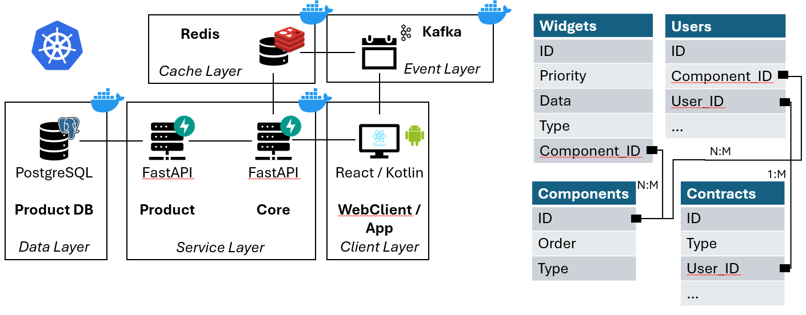
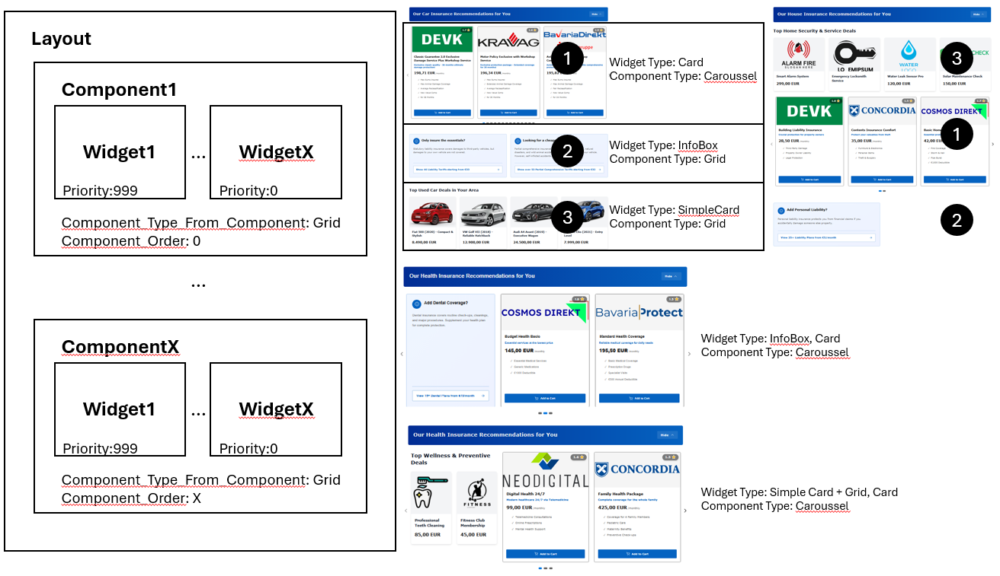
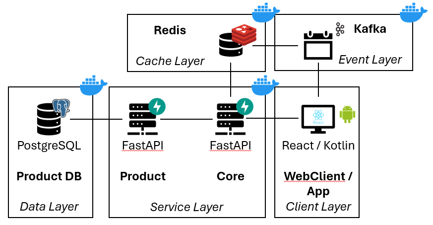

# CHECK24 Home Widgets - Technical Concept

## Executive Summary

This document provides the technical specification for the CHECK24 Home Widgets platform - a distributed, high-performance system enabling decentralized product teams to deliver personalized content to the CHECK24 Home experience across Web, and Android platforms.

**Key Achievements:**
- **Performance**: SWR caching strategy
- **Availability**: through circuit breakers and graceful degradation
- **Scalability**: Horizontal scaling of all components without single points of failure
- **Flexibility**: JSON-based contract enables multi-platform rendering without code changes
- **Personalisation**: via user, grouping of widgets by components and ordering
- **Developer Experience**: Clear integration path with minimal coupling to Core systems

---

## Table of Contents

1. [Conceptual System Architecture](#conceptual-system-architecture)
2. [Core Design Principles](#core-design-principles)
3. [Component Specifications](#component-specifications)
4. [API Contracts](#api-contracts)
5. [Data Flow & Orchestration](#data-flow--orchestration)
6. [Performance & Caching Strategy](#performance--caching-strategy)
7. [High Availability & Resilience](#high-availability--resilience)
8. [Deployment Architecture](#deployment-architecture)
9. [Decision Rationale](#decision-rationale)
10. [Deployment Strategy](#deployment-strategy)

---

## Conceptual System Architecture

### Overview

The Home Widgets platform follows a **Backend-for-Frontend (BFF) pattern** with a central Core Service acting as an intelligent aggregator and cache layer between client applications and decentralized product services. It mimics the CHECK24 company structure were the comparison products (product services) are individual legal entities (speedboats), which provide their own infrastructure (FastAPI server) and logic. The aggregator is the central homepage where an aggregated view is provided.

<p float="left">
  
</p>

### Widgets Design
The widgets are designed in a flexible way. Components aggregate widgets to a piece of the layout. Components control the order at the layout (see black circles) and the type of aggregation (e.g. widgets shown in a caroussel, etc.). The widgets control how they should be rendered (as card, etc.) and the order of the widgets. This allows for personalization and flexibility (see mixed types of widgets in one component).

<p float="left">
  
</p>

### Architectural Layers

#### Client Layer (Multi-Platform)
- **Web Client**: React + Vite, responsive design
- **Android App**: Kotlin + Jetpack Compose, native UI
- **Shared Contract**: All platforms consume identical JSON responses

#### Service Layer
##### Core Service (BFF)
- **Technology**: FastAPI (Python 3.12+)
- **Responsibilities**:
  - Widget aggregation from product services by components
  - Redis caching with SWR pattern
  - Circuit breaker protection
  - SSE-based real-time updates
  - User contract management
- **Horizontal Scaling**: Stateless design, can run N replicas

##### Product Service
- **Technology**: FastAPI (Python 3.12+)
- **Responsibilities**:
  - Widget content generation
  - User-specific personalization
  - Contract management
  - Event publishing via Kafka
- **Independence**: Each service owns its database and logic

#### Cache + Event Layer
- **Redis**: Distributed cache (SWR logic)
- **Kafka + Zookeeper**: Event streaming for cache invalidation
- **Docker Compose**: Local development & testing environment

#### Data Layer
- **PostgreSQL**: a database with widgets, contracts, users and components
- **DB Schema**: can be ignored in a real deployment, as every service has to deliver the same JSON contract and organizes itself, how the database is shaped and the API is aggregating this data (this is a suggestion)

#### Kubernetes
- **Kubernetes (K8s)**: Production-grade container orchestration replacing Docker Compose
- **Responsibilities**:
  - Cluster management and deployment
  - Service Discovery & Load Balancing
  - Auto-scale services 
  - Health checks
  - Monitoring 

---

## Core Design Principles

### 1. Server-Driven UI (SDUI) via JSON Contract

**Why**: Enables platform-agnostic widget delivery without client code changes.

**JSON Contract Structure**:
```json
{
  
  "component_id":"component_1",
  "component_order": 1,
  "component_type_from_component":"Card",
  "component_type": "Card",
  "widget_id": "car_insurance_offer_123",
  "priority": 1,
  "data": {
    "test": "test",
  }
}

```
The idea is that a component has a id. This id helps to aggregate widgets into one component at the client. The component_type_from_component helps to understand the client how they should be shown (Caroussel, Grid, ...) and the component_order dictates in which order the components should be shown. The widget_id is a label for the widget. The component type decides how the widget should be displayed (Card, Box, Grid, ...) and the data is specific data for the component_type to display. The priority shows which widgets should be shown first.

**Benefits**:
- **Zero Client Deploys**: Layout changes deploy via API updates only
- **A/B Testing**: Products can test variants by changing the order of the component, the aggregtion of the widgets, etc.
  **Personalization**: Each user can see different components / widgets, in varing order (dynamic layout)
- **Platform Consistency**: Same data = same UX across Web/Android
- **Type Safety**: Clients validate against well-defined schemas

### 2. Stale-While-Revalidate (SWR) Caching

**Problem**: Product services can't handle peak Home traffic (10-100x normal load).

**Solution**: Multi-tier caching with background refresh.

```
Request Flow:
1. Client → Core Service
2. Core Service checks Redis cache
3. IF cached AND fresh → return immediately
4. IF cached BUT stale → return stale + trigger background refresh
5. IF cache miss → fetch fresh + cache + return
```

**Configuration**:
- **TTL**: 1 hour (configurable per widget type)
- **SWR Grace Period**: 5 minutes
- **Cache Key Pattern**: `sdui:home_page:v1`

**Benefits**:
- **Response Time**: no waiting for backend services, once cache was refreshed / loaded
- **Uptime**: systems stays online, even during backend shortages
- **Reduced Backend Load**: fewer requests, due to immediate loading of the cache

### 3. Circuit Breaker Protection

**Problem**: Product service failures should not cascade to Home.

**Implementation**: PyBreaker library with per-service circuit breakers.

**Configuration**:
```python
FAILURE_THRESHOLD = 5  # Open circuit after 5 failures
RESET_TIMEOUT = 10     # Try again after 10 seconds
```

**States**:
- **CLOSED**: Normal operation, requests pass through
- **OPEN**: Service unavailable, return fallback immediately
- **HALF_OPEN**: Testing recovery, limited requests allowed

**Fallback Strategy**:
```json
{
  "widget_id": "fallback_error_card",
  "component_type": "Card",
  "data": {
    "title": "Service Temporarily Unavailable",
    "content": "We're working on it. Please try again soon."
  }
}
```
**Benefits**:
- **Cascading Failures**: Platform remains unblocked if service is not healthy
- **Fast-Fail**: Failing results in immediate action (after five retries)
- **Ressources**: Failing services don't get bombarded with requests

### 4. Event-Driven Cache Invalidation as a Dual Approach

**Problem**: Cached data becomes stale after user actions (e.g., contract purchase) or backend updates.

**Solution**: Kafka-based event streaming combined with time-based SWR for comprehensive cache freshness.

**Flow**:
1. User purchases car insurance → Product service writes to database
2. Product service publishes event: `user.car.insurance.purchased`
3. Core Service Kafka consumer receives event
4. Core Service invalidates relevant cache keys
5. Next Home request fetches fresh data
6. SSE notifies connected clients to refresh

**Topics**:
- `user.car.insurance.purchased`
- `user.health.insurance.purchased`
- `user.house.insurance.purchased`
- `user.banking.product.purchased`

**Event Schema**:
```json
{
  "event_type": "contract_created",
  "user_id": 123,
  "widget_id": "car_offer_456",
  "timestamp": "2025-01-15T10:30:00Z",
  "contract_id": 789
}
```

**Benefits**:
- **Relevance**: only show relevent widgets
- **Updates**: instant for user actions (invalidation of the cache)
- **Backend Changes**: are triggered via SWR

### 5. Decoupled Product Autonomy

**Key Principle**: Products control their widget content and personalization logic.

**What Core Service Does NOT Do**:
- ❌ Decide which widgets to show (business logic stays in products)
- ❌ Store user behavior data centrally
- ❌ Implement product-specific personalization rules

**What Core Service DOES Do**:
- ✅ Aggregate widgets from multiple services
- ✅ Cache responses for performance
- ✅ Protect against service failures
- ✅ Deliver consistent JSON to all platforms

---

## Component Specifications

### Core Service (BFF)

**Technology Stack**:
- **Framework**: FastAPI 0.104+
- **Language**: Python 3.12+
- **ASGI Server**: Uvicorn with async workers
- **HTTP Client**: HTTPX (async)

**Key Modules**:

#### 1. `/app/api/home.py` - Main API Endpoint
```python
@router.get("/home")
async def get_home_page_widgets(background_tasks: BackgroundTasks):
    """
    Aggregates widgets from all product services.
    Returns: ServiceData grouped by service key
    """
```

**Response Structure**:
```json
{
  "services": {
    "car_insurance": {
      "title": "Car Insurance Deals",
      "components": 
        [0]: {
          "component_id": 1,
          "component_order:" 0,
          "widgets": [...]
        }
    },
    "health_insurance": {
      [...]
    },
    [...]
  },
  "timestamp": "2025-12-19T12:00:00Z",
  "cache_key": "sdui:home_page:v1"
}
```

#### 2. `/app/core/cache.py` - SWR Cache Layer
```python
async def get_with_swr(
    key: str,
    fetch_function: Callable,
    background_tasks: BackgroundTasks
):
    """
    Implements Stale-While-Revalidate pattern.
    - Returns cached data immediately if available
    - Triggers background refresh if data is stale
    - Fetches fresh data on cache miss
    """
```

**Cache Configuration**:
```python
TTL = timedelta(hours=1)           # Primary cache lifetime
SWR_GRACE_PERIOD = timedelta(minutes=5)  # Stale-but-usable period
```

#### 3. `/app/core/clients.py` - Product Service Integration
```python
class ProductServiceClient:
    """
    Async HTTP client with circuit breaker protection.
    - Handles all communication with product services
    - Implements retry logic and timeouts
    - Returns fallback widgets on failure
    """
```

**Configuration**:
```python
TIMEOUT = 5.0  # seconds
RETRY_ATTEMPTS = 3
BACKOFF_FACTOR = 0.5
```

#### 4. `/app/workers/kafka_consumer.py` - Event Processor
```python
async def consume_and_invalidate_cache():
    """
    Consumes events from Kafka topics.
    - Invalidates Redis cache on contract events
    - Notifies SSE clients for real-time updates
    - Handles consumer group management
    """
```

**Consumer Configuration**:
```python
GROUP_ID = 'widget-cache-invalidator-group'
AUTO_OFFSET_RESET = 'earliest'
MAX_POLL_RECORDS = 500
```

### Product Services

**Common Structure** (applies to all: Car, Health, House, Banking):

#### Database Schema
```sql
-- TABLE 1: components
CREATE TABLE "public"."components" (
    "component_id" VARCHAR(100) NOT NULL,
    "user_id" INTEGER NOT NULL,
    "component_type" VARCHAR(50) NOT NULL,
    "component_order" INTEGER DEFAULT 0,
    CONSTRAINT "components_pkey" PRIMARY KEY ("component_id", "user_id")
);

-- TABLE 2: widgets  
CREATE TABLE "public"."widgets" (
    "user_id" INTEGER NOT NULL,
    "widget_id" VARCHAR(100) NOT NULL,
    "component_type" VARCHAR(50) NOT NULL,
    "priority" INTEGER DEFAULT 0,
    "data" JSONB NOT NULL,
    "component_id" VARCHAR(100) DEFAULT 'default_component',
    CONSTRAINT "widgets_pkey" PRIMARY KEY ("widget_id"),
    CONSTRAINT "widgets_unique_user_widget" UNIQUE ("user_id", "widget_id")
);

-- TABLE 3: contracts

CREATE TABLE "public"."contracts" (
    "id" INTEGER DEFAULT nextval('contracts_id_seq') NOT NULL,
    "user_id" INTEGER NOT NULL,
    "widget_id" VARCHAR(100) NOT NULL,
    "type" VARCHAR(50),
    CONSTRAINT "contracts_pkey" PRIMARY KEY ("id"),
    CONSTRAINT "contracts_unique_user_widget" UNIQUE ("user_id", "widget_id")
);
```

#### Key Endpoints

**1. Widget Retrieval**
```
GET /widget/{service-key}
Response: { "widgets": [...] }
```

**Logic**:
- If user has active contract → return empty array
- If user has no contract → return personalized widgets
- Products decide filtering/ranking logic independently

**2. Contract Creation**
```
POST /widget/{service-key}/contract
Body: { "user_id": 123, "widget_id": "offer_456" }
Response: { "contract_id": 789, "message": "Success" }
```

**Side Effects**:
- Writes to local database
- Publishes Kafka event for cache invalidation
- Triggers Core Service cache refresh via POST `/cache/invalidate`

**3. Contract Deletion**
```
DELETE /widget/{service-key}/contract/{user_id}/{widget_id}
Response: { "contract_id": 789, "message": "Deleted" }
```

**Side Effects**:
- Removes from local database
- Publishes Kafka event
- Triggers cache invalidation

**4. User Contracts**
```
GET /widget/{service-key}/contract/{user_id}
Response: Widget data for user's active contract
```

---

## API Contracts

### Core Service → Client Applications

#### GET `/home`
**Purpose**: Fetch all widgets for Home page grouped by service and component

**Response Schema**:
```typescript
interface HomeResponse {
  services: {
    [serviceKey: string]: {
      title: string;
      components: Component[];  // ← NEW: Components instead of flat widgets
    }
  };
  timestamp: string;
  cache_key: string;
  stats: {
    total_services: number;
    total_components: number;
    total_widgets: number;
  };
}

interface Component {
  component_id: string;           // e.g., "carousel_featured"
  component_order: number;        // Display order (1 = first)
  component_type: ComponentType;  // Type of UI component
  widgets: Widget[];              // Widgets within this component
}

type ComponentType = 
  | 'Carousel'        // Horizontal scrolling carousel
  | 'ProductGrid'     // Grid layout
  | 'Card'            // Single card
  | 'InfoBox'         // Information display
  | 'SectionHeader';  // Section title

interface Widget {
  widget_id: string;
  component_type: ComponentType;  // Inherited from component
  component_id: string;           // Parent component ID
  component_order: number;        // Component's display order
  priority: number;               // Widget order within component
  service: string;                // e.g., "car_insurance"
  data: WidgetData;
}

interface WidgetData {
  // Common fields
  title?: string;
  subtitle?: string;
  content?: string;
  image_url?: string;
  
  // Pricing information
  pricing?: {
    price: number;
    currency: string;
    frequency?: 'monthly' | 'yearly' | 'one-time';
    original_price?: number;      // For showing discounts
  };
  
  // Rating/Review
  rating?: {
    score: number;                // 0-5
    count?: number;               // Number of reviews
  };
  
  // Provider/Company
  provider?: {
    name: string;
    logo_url?: string;
  };
  
  // Call-to-action
  cta?: {
    text: string;                 // e.g., "Get Quote"
    url?: string;
    action?: 'purchase' | 'compare' | 'details';
  };
  
  // Component-specific fields
  header?: string;                // For SectionHeader
  body?: string;                  // For InfoBox, Card
  features?: string[];            // For ProductGrid items
  badge?: string;                 // e.g., "Best Value", "Popular"
}
```

#### GET `/user/{user_id}/contracts`
**Purpose**: Fetch user's active contracts across all services

**Response**:
```json
{
  "has_contract": true,
  "contracts": {
    "car_insurance": {
      "widget_id": "devk_offer_123",
      "data": { ... }
    },
    "health_insurance": null
  }
}
```

#### GET `/stream/updates`
**Purpose**: Server-Sent Events for real-time cache updates

**Event Format**:
```javascript
data: {"type":"cache_invalidated","timestamp":"...","reason":"contract_created","user_id":123}
```

**Client Implementation**:
```javascript
const eventSource = new EventSource('http://api.check24.de/stream/updates');
eventSource.onmessage = (event) => {
  const data = JSON.parse(event.data);
  if (data.type === 'cache_invalidated') {
    // Refetch home data
  }
};
```

### Core Service → Product Services

#### GET `/widget/{service-key}`
**Purpose**: Core fetches widgets from product service

**Expected Response**:
```json
{
  "widgets": [
    {
      "widget_id": "unique_id_123",
      "component_type": "Card",
      "component_id":1,
      "component_type_from_component": "Grid",
      "component_order":0,
      "priority": 1,
      "data": { ... }
    }
  ]
}
```

**Contract Requirements**:
- Must respond within 5 seconds (timeout)
- Must return valid JSON (schema validation)
- Empty array = no widgets for user (valid state)

---

## Data Flow & Orchestration

### Primary Flow: Home Page Load

```
┌─────────┐
│ Client  │
└────┬────┘
     │ GET /home
     ▼
┌─────────────────┐
│  Core Service   │
└────┬────────────┘
     │ Check Redis Cache
     ▼
┌─────────────────┐       ┌──────────────┐
│  Redis Cache    │──────▶│ Cache Hit?   │
└─────────────────┘       └──┬───────┬───┘
                             │ Yes   │ No
                             ▼       ▼
                      ┌──────────┐  ┌────────────────┐
                      │ Return   │  │ Fetch from     │
                      │ Cached   │  │ Product        │
                      │ Data     │  │ Services       │
                      └──────────┘  └────┬───────────┘
                                         │ (Parallel)
                                         ▼
                      ┌────────────────────────────────┐
                      │ Car | Health | House | Banking │
                      └────┬───────────────────────────┘
                           │ Aggregate Results
                           ▼
                      ┌────────────────┐
                      │ Cache in Redis │
                      └────┬───────────┘
                           │
                           ▼
                      ┌────────────────┐
                      │ Return to      │
                      │ Client         │
                      └────────────────┘
```

### Secondary Flow: Contract Purchase

```
┌─────────┐
│  User   │
└────┬────┘
     │ Clicks "Add to Cart"
     ▼
┌─────────────────┐
│  Client App     │
└────┬────────────┘
     │ POST /widget/{service}/contract
     ▼
┌──────────────────────┐
│  Product Service     │
│  1. Create contract  │
│  2. Save to DB       │
│  3. Publish Kafka    │
│  4. POST /cache/     │
│     invalidate       │
└────┬─────────────────┘
     │
     ├──────────────────┐
     │ Kafka Event      │ HTTP POST
     ▼                  ▼
┌──────────────┐  ┌─────────────────┐
│ Kafka Topic  │  │ Core Service    │
└────┬─────────┘  │ DELETE cache    │
     │            └─────────────────┘
     │ Core Service consumer
     ▼
┌──────────────────────┐
│ Core Service         │
│ 1. Invalidate cache  │
│ 2. Notify SSE clients│
└────┬─────────────────┘
     │ SSE Event
     ▼
┌─────────────────┐
│ Client App      │
│ Refetch /home   │
└─────────────────┘
```

**Key Insight**: Dual invalidation strategy ensures:
1. **Immediate invalidation**: POST `/cache/invalidate` (sync)
2. **SSE notifications**: Kafka event → consumer → SSE (async)

This eliminates race conditions where a client might request data before the cache invalidates.

---

## Performance & Caching Strategy

### Cache Architecture

**Redis Configuration**:
```yaml
version: '3'
services:
  redis:
    image: redis:7-alpine
    command: redis-server --maxmemory 256mb --maxmemory-policy allkeys-lru
    ports:
      - "6379:6379"
```

**Cache Key Strategy**:
- **Pattern**: `sdui:home_page:v1`

### SWR Implementation Details

**Phase 1: Cache Hit (Fresh)**
```python
ttl_remaining = await redis_client.ttl(key)
if ttl_remaining > SWR_GRACE_PERIOD:
    return cached_data  # Fresh data, <50ms response
```

**Phase 2: Cache Hit (Stale)**
```python
if 0 < ttl_remaining <= SWR_GRACE_PERIOD:
    await redis_client.expire(key, SWR_GRACE_PERIOD)  # Extend TTL
    background_tasks.add_task(_revalidate_and_update)  # Async refresh
    return cached_data  # Stale data, but still fast
```

**Phase 3: Cache Miss**
```python
fresh_data = await fetch_from_services()
await redis_client.setex(key, TTL, json.dumps(fresh_data))
return fresh_data  # <300ms response
```

### Circuit Breaker Metrics

**Per-Service Configuration**:
```python
car_insurance_breaker = CircuitBreaker(
    fail_max=5,          # Open after 5 failures
    reset_timeout=10     # Try again after 10s
)
```

**Fallback Behavior**:
- Circuit OPEN → Return fallback widget (no delay)
- Circuit HALF_OPEN → Limited requests to test recovery
- Circuit CLOSED → Normal operation

**Impact**:
- Failed service does NOT impact other services
- Home page remains available at all times
- Fallback widgets provide graceful degradation

---

## High Availability & Resilience

### Failure Scenarios & Mitigations

#### Scenario 1: Single Product Service Down
**Mitigation**:
- Circuit breaker returns fallback widget
- Other services continue normally
- Home page loads with N-1 sections

**User Impact**: Minimal - sees 3/4 services

#### Scenario 2: Redis Cache Down
**Mitigation**:
```python
try:
    cached_data = await redis_client.get(key)
except Exception:
    logger.error("Redis unavailable, fetching fresh")
    return await fetch_from_services()
```

**User Impact**: Slower responses (~300ms) until Redis recovers

#### Scenario 3: Kafka Down
**Mitigation**:
- Cache invalidation via HTTP POST still works
- SSE notifications delayed but not lost
- System continues with slightly stale cache

**User Impact**: Cache invalidation takes 5-10 minutes instead of seconds

#### Scenario 4: All Product Services Down
**Mitigation**:
- Return cached data (even if stale)
- If cache empty: return empty widgets array
- Log critical alert for operations team

**User Impact**: Home page loads, but no personalized widgets

#### Scenario 5: Database Connection Loss
**Mitigation**:
```python
def get_db():
    try:
        db = SessionLocal()
        yield db
    except OperationalError as e:
        raise HTTPException(status_code=503, detail="Database unavailable")
    finally:
        db.close()
```

**User Impact**: 503 error for that specific service (others unaffected)
---

## Deployment Architecture

### Container Strategy

**Docker Images**:
1. `core-service:latest` - FastAPI BFF
2. `car-insurance-service:latest` - Product service
3. `health-insurance-service:latest` - Product service
4. `house-insurance-service:latest` - Product service
5. `banking-service:latest` - Product service
6. `zookeeper:latest` - Zookeeper
7. `kafka:latest` - Kafka
8. `web-client:latest` - React frontend

**Orchestration**:
```yaml
# docker-compose.yml (simplified)
```

### Infrastructure Components

**Required Services**:
1. **Redis**: Caching layer
2. **Kafka + Zookeeper**: Event streaming
3. **PostgreSQL**: 4 instances (1 per service)

**Architecture**:
<p float="left">
  
</p>

### Deployment Process

**1. Build Phase**:
```bash
docker-compose build --no-cache
```

**2. Database Initialization**:
```sql
-- Run migrations for each service
-- Seed initial widget data
```

**3. Service Startup Order**:
1. Infrastructure (Redis, Kafka, Zookeeper, PostgreSQL)
2. Product Services
3. Core Service
4. Frontend Applications

**4. Health Checks**:
```bash
# Verify all services are healthy
curl http://localhost:8000/health
curl http://localhost:8001/health
```

**5. Smoke Tests**:
```bash
# Test widget retrieval
curl http://localhost:8000/home
```
---

## Decision Rationale

### Why FastAPI?

**Decision**: FastAPI (Python) for Core Service and Product Services

**Reasons**:
1. **Async First**: Native async/await for non-blocking I/O
2. **Type Safety**: Pydantic models ensure contract validation
3. **Ecosystem**: Rich libraries (HTTPX, Redis, Kafka)
4. **Auto-Documentation**: OpenAPI/Swagger generated automatically (future maintainability)

### Why Stale-While-Revalidate (SWR)?

**Decision**: SWR caching pattern

**Alternatives Considered**:
- Cache-Aside (fetch on miss, no background refresh)
- Write-Through (update cache on every write)
- TTL-only (no stale serving)

**Rationale**:
1. **Performance**: Serve stale data instantly (no blocking)
2. **Availability**: Continue serving even if backend is down
3. **User Experience**: No loading spinners for cache refresh

**Trade-offs**:
- Users might see slightly stale data (5 min grace period)
- Increased complexity vs simple TTL cache

### Why Redis?

**Decision**: Redis for caching layer

**Reasons**:
1. **Data Structures**: Strings, hashes, lists (useful for future)
2. **Persistence**: Optional RDB/AOF snapshots (cache warmup)
3. **Clustering**: Built-in Redis Cluster (horizontal scaling)
4. **Scalability**: Redis Cluster for horizontal scaling
5. **Community**: Mature, well-documented
6. **SWR Pattern**: TTL + background refresh (Redis native support)

### Why Kafka?

**Decision**: Kafka for event streaming

**Reasons**:
1. **Apache**: Open source, community support
2. **Decoupling**: Product services don't need Core Service URL

### Why Docker Compose for PoC (not Kubernetes)?

**Decision**: Docker Compose for local development

**Reasons**:
1. **Simplicity**: Easy setup for reviewers
2. **Portability**: Runs on any machine (Mac, Windows, Linux)
3. **Learning Curve**: Developers familiar with Docker
4. **Fast Iteration**: Rebuild = 30 seconds vs K8s manifest complexity
5. **Reproducibility**: Identical environments (dev/staging/prod)

In production Kubernetes should be used for orchestration.

### Why BFF Pattern?

**Reasons**:
1. **Performance**: Centralized caching reduces product service load
2. **Security**: Single authentication/authorization point
3. **Flexibility**: Clients don't need to know about product services
4. **Aggregation**: Parallel fetching + circuit breaker in one place
5. **Multi-Platform**: Same API for Web and Android

**Trade-offs**:
- Extra hop (latency) → mitigated by caching
- Potential bottleneck → mitigated by horizontal scaling
---

#### Why PostgreSQL?

**Decision**: PostgreSQL for product service databases

**Alternatives Considered**:
- MySQL
- MongoDB (NoSQL)

**Rationale**:
1. **JSONB Support**: Store widget data as structured JSON
2. **ACID Transactions**: Contract creation = atomic (widget + contract)
3. **Mature ORM**: SQLAlchemy excellent support
4. **Cost**: Open-source, no licensing fees

**Trade-offs**:
- NoSQL (MongoDB) might scale better for document storage

---

### Shortcuts Taken in PoC

**1. Hardcoded User ID**
- PoC: `user_id = 123`
- Production: Extract from JWT token

**2. Single Redis Instance**
- PoC: `redis:latest` (single container)
- Production: Redis Cluster (high availability)

**3. No Authentication**
- PoC: Open endpoints
- Production: API Gateway + JWT

**4. No Load Balancer**
- PoC: Direct service access
- Production: Nginx/AWS ALB

**5. No Persistent Volumes**
- PoC: Data lost on container restart
- Production: Persistent volumes for PostgreSQL, Redis

**6. Minimal Error Handling**
- PoC: Basic try/catch
- Production: Retry logic, exponential backoff, dead letter queues

---

## Deployment Strategy

### Overview

The deployment follows a **progressive rollout strategy** with continuous monitoring and statistical validation at each stage. This minimizes risk while gathering data on the new widget architecture's impact on user behavior.

---

### Phase 1: Internal Beta (Employees)

**Target Audience**: CHECK24 employees and internal testers

**Scale**: ~500-1,000 users

**Rationale**: 
- Safe environment to catch obvious issues
- Quick feedback loop from technical users
- No customer impact

**Metrics to Track**:
- Page load time
- Widget interaction rate (clicks, conversions)
- Error rates
- Qualitative feedback via internal survey

**Success Criteria**:
- No critical bugs reported
- Performance meets targets
- Positive feedback from internal users (>80% satisfaction)

**Duration**: 1 week

**Decision Point**: Proceed to Phase 2 if stable and well-received

---

### Phase 2: B-Customer Test Group (Statistical Validation)

#### Target Audience

**B-Customers**: Regular users who visit the platform frequently but are not VIP or high-value customers.

**Why B-Customers First?**
1. **Lower Business Risk**: Not our most valuable customers, so financial impact of issues is limited
2. **Representative Sample**: Still exhibit normal user behavior patterns
3. **Sufficient Volume**: Enough users for statistically significant results
4. **Ethical Testing**: Test on willing participants before affecting star customers

**Scale**: 5% of B-customer traffic (~5,000-10,000 users)

---

#### A/B Test Design

**Control Group (50% of selected B-customers)**: 
- See legacy homepage with static widgets
- Baseline performance metrics

**Treatment Group (50% of selected B-customers)**:
- See new widget platform with dynamic Server-Driven UI
- New architecture metrics

**Randomization**: Users randomly assigned to control or treatment group based on user ID hash (ensures consistency across sessions)

---

#### Metrics & Statistical Analysis

**Primary Business Metrics**:
1. **Conversion Rate**: Percentage of users who purchase or sign a contract
2. **Click-Through Rate (CTR)**: Percentage of users who interact with widgets
3. **Time on Page**: Average session duration
4. **Bounce Rate**: Percentage of users who leave immediately
5. **Revenue per User**: Average transaction value

**Secondary Metrics**:
1. **Page Load Time**: Performance comparison
2. **Error Rate**: Stability comparison
3. **Widget Engagement Depth**: How many widgets users view/interact with

**Statistical Testing Approach**:
- Use two-proportion z-test or chi-square test for conversion rate comparison
- T-test for continuous metrics (time on page, revenue)
- Significance level: p < 0.05 (95% confidence)
- Minimum sample size: 10,000 users per group (calculated via power analysis)

**Example Decision Logic**:
- If treatment conversion rate is **statistically significantly higher** (p < 0.05) → Strong proceed signal
- If treatment conversion rate is **not significantly different** (p ≥ 0.05) but **not worse** → Cautious proceed
- If treatment conversion rate is **significantly lower** → Stop and investigate

---

#### Behavioral Analysis

Beyond aggregate metrics, analyze user behavior changes:

**Engagement Patterns**:
- Are users scrolling through more widgets?
- Are users engaging with different product categories?
- Is personalization driving more diverse interactions?

**Segment Analysis**:
- Break down results by user demographics (age, location)
- Identify if certain segments benefit more than others
- Detect any negative impacts on specific user groups

**Qualitative Insights**:
- Survey subset of users about experience
- Analyze support tickets for new issues
- Monitor social media mentions

---

#### Decision Criteria

**Proceed to Phase 3 if**:
- Conversion rate is statistically significantly higher OR not significantly different (not worse)
- No critical bugs or stability issues
- Error rate remains below 0.1%
- Performance degradation less than 10%
- No negative user feedback trends

**Hold/Iterate if**:
- Mixed signals (some metrics up, some down)
- Performance issues detected
- Specific user segments negatively affected

**Rollback if**:
- Conversion rate drops more than 5%
- Error rate exceeds 1%
- Critical bugs affecting user experience
- Significant negative user feedback

**Duration**: 2-3 weeks (minimum for statistical significance with expected traffic)

---

### Phase 3: Gradual Rollout by Geography

#### Strategy

Roll out the new widget platform **state-by-state** across Germany (by Bundesland).

**Why Geographic Rollout?**
1. **Natural Segmentation**: Users in different states are independent populations
2. **Localized Issue Detection**: Easy to identify region-specific bugs or performance issues
3. **Risk Isolation**: If one state experiences issues, other states remain on stable platform
4. **Regulatory Compliance**: Easier to manage if different states have different regulations
5. **Infrastructure Testing**: Validates system under varying load patterns

---

#### Rollout Schedule

**Week 1: Bavaria (Bayern)**
- **Rationale**: Largest state by area, second-largest by population (~13M)
- **Why first**: Good test case - if it works in Bavaria, likely works elsewhere
- **Rollout**: 100% of Bavaria users switch to new platform
- **Monitor**: 3-5 days of stability before next state

**Week 2: North Rhine-Westphalia (Nordrhein-Westfalen)**
- **Rationale**: Most populous state (~18M residents)
- **Validation**: Highest traffic volume - ultimate stress test
- **Monitor**: Compare Bavaria (week 2) vs NRW (week 1) for consistency

**Week 3: Baden-Württemberg + Hesse (Baden-Württemberg + Hessen)**
- **Rationale**: High-value markets, Stuttgart & Frankfurt regions
- **Rollout**: 2 states simultaneously (precedent established)

**Week 4: Lower Saxony + Berlin (Niedersachsen + Berlin)**
- **Rationale**: Mix of urban (Berlin) and rural (Lower Saxony)
- **Validation**: Tests platform across different user density patterns

**Week 5: Rhineland-Palatinate, Schleswig-Holstein, Hamburg**
- **Rationale**: Smaller states, lower risk
- **Rollout**: 3 states at once (accelerating)

**Week 6: Remaining States**
- **Rollout**: All remaining states (Saxony, Brandenburg, etc.)
- **Final validation**: Platform now serving 90%+ of Germany

---

#### Monitoring per State

**For Each New State**:

**Day 1-2**: Intensive monitoring
- Real-time dashboard tracking
- On-call engineer dedicated to rollout
- Immediate rollback capability

**Day 3-5**: Comparative analysis
- Compare new state metrics to already-rolled-out states
- Ensure consistency (no anomalies)
- Validate infrastructure scales appropriately

**Key Metrics per State**:
1. **User Metrics**: Same as Phase 2 (conversion, CTR, session time)
2. **Infrastructure Metrics**: Response time, error rate, cache hit ratio
3. **Comparative Metrics**: New state vs already-live states (should be similar)

---

#### Rollback Strategy

**Immediate Rollback Triggers** (within 1 hour):
- Error rate spikes above 1%
- Response time exceeds 1 second (p95)
- Critical bug affecting transactions
- Database connection failures

**Rollback Mechanism**:
- Feature flag toggle (instant)
- Users in affected state revert to legacy homepage
- No data loss (both platforms use same backend)
- Can retry rollout after fix

**Example Timeline**:
```
10:00 - Deploy Bavaria rollout
10:15 - Error rate spike detected (0.8% → 2.5%)
10:20 - Rollback initiated (feature flag toggled)
10:22 - Bavaria users back on legacy platform
10:25 - Investigation begins
14:00 - Bug identified and fixed
Next day - Retry Bavaria rollout
```

---

#### Progressive Confidence Building

As more states are successfully rolled out:
- **Acceleration**: Start with 1 state/week, end with 3+ states/week
- **Reduced Monitoring**: Less intensive monitoring as confidence grows
- **Automation**: Automated rollout scripts reduce manual intervention

---

### Phase 4: Full Production (100%)

**When**: After all geographic regions validated (Week 7+)

**Final Steps**:
1. **Universal Rollout**: All remaining users (A-customers, international if applicable)
2. **Feature Flag Removal**: New platform becomes default (no toggle)
3. **Legacy Sunset**: 
   - Week 7-8: Both platforms coexist (safety net)
   - Week 9: Mark legacy endpoints as deprecated
   - Week 10: Remove legacy code entirely

**Post-Launch Monitoring**:
- Continue tracking metrics for 4 weeks
- Monthly reviews for 6 months
- Automated alerts for anomalies

---

### Success Metrics & Post-Launch Review

#### Success Definition

**The rollout is successful if:**
1. ✅ Conversion rate ≥ legacy platform (statistically validated)
2. ✅ No increase in error rate (< 0.1%)
3. ✅ Performance within SLA (p95 < 300ms)
4. ✅ Zero critical incidents during rollout
5. ✅ Positive user feedback (NPS score maintained or improved)

#### Post-Launch Report

**Week 12**: Final analysis report covering:
- A/B test results with statistical analysis
- Geographic rollout timeline and issues encountered
- Infrastructure performance and cost analysis
- User behavior changes observed
- Lessons learned and future improvements

---

### Risk Mitigation Summary

| Risk | Mitigation Strategy |
|------|---------------------|
| New platform performs worse | A/B testing validates before full rollout |
| Infrastructure cannot scale | Geographic rollout tests scalability incrementally |
| Critical bug affects all users | Feature flags enable instant rollback |
| Users dislike new experience | B-customers tested first, user feedback monitored |
| Revenue drops during migration | Gradual rollout limits exposure, immediate rollback available |
| Team lacks confidence | Internal beta builds expertise, progressive rollout builds confidence |

---

### Timeline Summary

```
Week 0:    Pre-Production Validation (staging)
Week 1:    Internal Beta (employees)
Week 2-4:  B-Customer A/B Test (statistical validation)
Week 5:    Bavaria rollout
Week 6:    North Rhine-Westphalia rollout
Week 7:    2-3 additional states
Week 8:    2-3 additional states
Week 9:    Remaining states
Week 10:   Full production (100%)
Week 11:   Legacy platform sunset
Week 12:   Post-launch review
```

**Total Duration**: ~12 weeks from staging to full production

---

## Appendix

### A. Environment Variables

**Core Service** (`core-service/.env`):
```env
REDIS_HOST=redis
REDIS_PORT=6379
KAFKA_BROKER=kafka:9093
CAR_INSURANCE_SERVICE_URL=http://localhost:8000
HEALTH_INSURANCE_SERVICE_URL=http://localhost:8000
HOUSE_INSURANCE_SERVICE_URL=http://localhost:8000
BANKING_SERVICE_URL=http://localhost:8000
```

**Product Service** (`car-insurance-service/.env`):
```env
DB_HOST=product-db-car
DB_USER=product_user
DB_PASSWORD=product_password
DB_NAME=car_insurance_db
KAFKA_BROKER=kafka:9093
CORE_SERVICE_URL=http://core-service:8000
```

## Glossary

- **BFF**: Backend for Frontend - API layer tailored for specific client needs
- **SDUI**: Server-Driven UI - UI structure defined by API responses
- **SWR**: Stale-While-Revalidate - Caching strategy for fresh data
- **Circuit Breaker**: Failure protection pattern (stop calling failing services)
- **SSE**: Server-Sent Events - One-way real-time communication (server → client)
- **Kafka**: Distributed event streaming platform
- **Redis**: In-memory data store (cache)
- **TTL**: Time-to-Live - Cache expiration time
- **HTTPX**: Modern async HTTP client for Python

---

*Document Version: 1.0*  
*Last Updated: December 27, 2025*  
