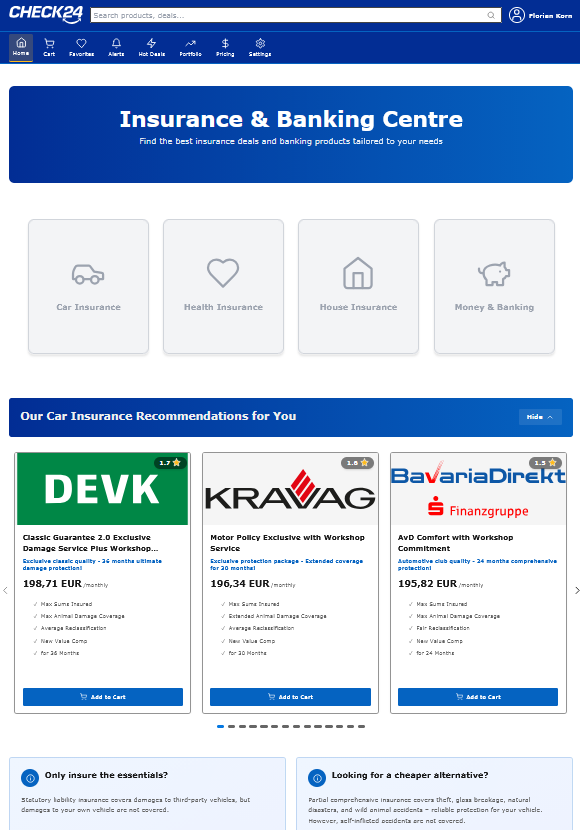

# CHECK24 Home Widgets Platform

## 🎯 Project Overview

This repository contains a complete implementation of the **CHECK24 Home Widgets Platform** - a distributed, high-performance system that enables decentralized product teams to deliver personalized content to the CHECK24 Home experience across Web and Android platforms.

**Key Features:**
- ✅ Server-Driven UI (SDUI) via JSON contracts
- ✅ SWR caching
- ✅ availability through circuit breakers
- ✅ Real-time cache invalidation via Kafka + SSE
- ✅ Personalization via user, dynamic layout by components (with ordering) and mixed widget grouping in components
- ✅ Multi-platform support (Web/React, Android/Kotlin)
- ✅ Zero client deploys for content/layout changes

**Preview WebApp and Android App:**
<p float="left">
  
   
  
  
</p>

---

## 📚 Deliverables

### For Core Engineering Teams
👉 **[CONCEPT.md](./CONCEPT.md)** - Complete technical specification for implementing the platform

**What's Inside:**
- System architecture & component specifications
- API contracts & data flows
- Performance & caching strategy (SWR pattern)
- High availability & resilience patterns
- Deployment architecture
- Decision rationale & trade-offs

### For Product Development Teams
👉 **[DEVELOPER_GUIDELINE.md](./DEVELOPER_GUIDELINE.md)** - Integration guide for product teams

**What's Inside:**
- Quick start guide (5-minute setup)
- Widget JSON contract specification
- Required API endpoints
- Component types (Card, InfoBox, ProductGrid)
- Personalization strategies
- Testing & troubleshooting

### 🎥 Application Video

**Video URL:** [https://youtu.be/afz6HEtqgXk](https://youtu.be/afz6HEtqgXk)

### Live Deployed
**Demo URL:** [https://check24-challenge-gamma.vercel.app/](https://check24-challenge-gamma.vercel.app/)

---

## 🏗️ Architecture Overview

```
┌─────────────────────────────────────────────────────────────┐
│                    Client Layer                             │
│  ┌──────────────┐                      ┌──────────────┐     │
│  │  Web Client  │                      │ Android App  │     │
│  │  (React)     │                      │  (Kotlin)    │     │
│  └──────┬───────┘                      └──────┬───────┘     │
└─────────┼─────────────────────────────────────┼─────────────┘
          │                                     │
          └──────────────────┬──────────────────┘
                             │ HTTPS/JSON
                             ▼
          ┌──────────────────────────────────────┐
          │      Core Service (BFF)              │
          │  - FastAPI REST API                  │
          │  - Redis Cache (SWR Pattern)         │
          │  - Kafka Consumer (Invalidation)     │
          │  - Circuit Breaker Protection        │
          └──────────────┬───────────────────────┘
                         │
                         ▼
          ┌──────────────────────────────────────┐
          │    Product Services Layer            │
          │  - Car Insurance Service             │
          │  - Health Insurance Service          │
          │  - House Insurance Service           │
          │  - Banking Service                   │
          │  Each with: PostgreSQL + Kafka       │
          └──────────────────────────────────────┘
```

**Core Design Principles:**
1. **Server-Driven UI**: JSON contracts enable zero-client-deploy updates
2. **Stale-While-Revalidate**: Balance data freshness with service protection
3. **Circuit Breakers**: Fail gracefully, isolate failures
4. **Event-Driven**: Real-time cache invalidation via Kafka
5. **Decoupled Autonomy**: Products control their widgets independently

---

## 📦 Repository Structure

```
.
├── CONCEPT.md                      # Technical specification (Core teams)
├── DEVELOPER_GUIDELINE.md          # Integration guide (Product teams)
├── README.md                       # This file
│
├── docker-compose.yml              # Local development setup
│
├── core-service/                   # BFF - Widget aggregator
│   ├── app/
│   │   ├── main.py                 # FastAPI app
│   │   ├── api/home.py             # Main API endpoints
│   │   ├── core/
│   │   │   ├── cache.py            # SWR caching logic
│   │   │   ├── clients.py          # Product service clients
│   │   │   ├── models.py           # Pydantic models
│   │   │   └── logging_config.py   # Structured logging
│   │   └── workers/
│   │       └── kafka_consumer.py   # Cache invalidation worker
│   ├── Dockerfile
│   └── requirements.txt
│
├── car-insurance-service/          # Product service example
│   ├── app/
│   │   ├── main.py                 # FastAPI app
│   │   └── core/
│   │       └── logging_config.py
│   ├── db_init/init.sql            # Database schema + seed data
│   ├── Dockerfile
│   └── requirements.txt
│
├── health-insurance-service/       # Product service
├── house-insurance-service/        # Product service
├── banking-service/                # Product service
│
├── web-client/                     # React frontend
│   ├── src/
│   │   ├── components/
│   │   │   ├── widgets/            # Widget renderers
│   │   │   └── layout/             # Header, Footer, Navigation
│   │   ├── pages/HomePage.jsx      # Main home page
│   │   ├── contexts/               # React context (notifications)
│   │   ├── utils/imageLoader.js    # Asset URL resolver
│   │   └── styles/                 # CSS modules
│   ├── package.json
│   └── vite.config.js
│
└── android-client/                 # Kotlin + Jetpack Compose
    ├── app/src/main/
    │   ├── kotlin/
    │   │   ├── data/
    │   │   │   ├── api/ApiService.kt
    │   │   │   ├── model/Models.kt
    │   │   │   └── repository/Check24Repository.kt
    │   │   ├── ui/
    │   │   │   ├── components/     # Composable widgets
    │   │   │   ├── screens/HomeScreen.kt
    │   │   │   └── theme/          # Material 3 theme
    │   │   └── MainActivity.kt
    │   └── res/
    ├── build.gradle.kts
    └── settings.gradle.kts
```

---

## 🚦 Quick Start

### Prerequisites

- Docker 20.10+ & Docker Compose 2.0+
- Python 3.12+ (for local development)
- Node.js 18+ (for web client)
- Android Studio (for Android app)

### 1. Start All Services

```bash
# Clone repository
git clone

# Start infrastructure + services
docker-compose up -d

# Verify all services are healthy
docker-compose ps
```

**Expected Output:**
```
NAME                  STATUS          PORTS
core-service          Up              0.0.0.0:8000->8000/tcp
car-insurance         Up              0.0.0.0:8001->8000/tcp
health-insurance      Up              0.0.0.0:8002->8000/tcp
house-insurance       Up              0.0.0.0:8003->8000/tcp
banking-service       Up              0.0.0.0:8004->8000/tcp
redis                 Up              0.0.0.0:6379->6379/tcp
kafka                 Up              0.0.0.0:9092->9092/tcp
zookeeper             Up              0.0.0.0:2181->2181/tcp
```

### 2. Test Core API

```bash
# Fetch home widgets
curl http://localhost:8000/home | jq

# Expected: JSON with services (car_insurance, health_insurance, etc.)
```

### 3. Start Web Client

```bash
cd web-client
npm install
npm run dev

# Open http://localhost:5173
```

### 4. Test Android App

```bash
cd android-client
./gradlew assembleDebug
adb install app/build/outputs/apk/debug/app-debug.apk

# Launch app on device/emulator
```

### 5. Test Contract Purchase Flow

```bash
# Create car insurance contract
curl -X POST http://localhost:8001/widget/car-insurance/contract \
  -H "Content-Type: application/json" \
  -d '{"user_id": 123, "widget_id": "car_offer_devk"}'

# Verify cache invalidation
curl http://localhost:8000/home | jq '.services.car_insurance.widgets | length'
# Expected: 0 (widgets hidden after purchase)
```

---

## 📊 Monitoring

### Health Checks

```bash
# Core Service
curl http://localhost:8000/health

# Product Services
curl http://localhost:8001/health  # Car Insurance
curl http://localhost:8002/health  # Health Insurance
curl http://localhost:8003/health  # House Insurance
curl http://localhost:8004/health  # Banking
```

## 🔧 Configuration

### Environment Variables

**Core Service** (`core-service/.env`):
```env
REDIS_HOST=redis
REDIS_PORT=6379
KAFKA_BROKER=kafka:9093

CAR_INSURANCE_SERVICE_URL=http://car-insurance-service:8000
HEALTH_INSURANCE_SERVICE_URL=http://health-insurance-service:8000
HOUSE_INSURANCE_SERVICE_URL=http://house-insurance-service:8000
BANKING_SERVICE_URL=http://banking-service:8000
```

**Product Service** (`car-insurance-service/.env`):
```env
DB_HOST=product-db-car
DB_USER=product_user
DB_PASSWORD=product_password
DB_NAME=car_insurance_db
KAFKA_BROKER=kafka:9093
CORE_SERVICE_URL=http://core-service:8000
```

### Cache TTL Configuration

```python
# core-service/app/core/cache.py
TTL = timedelta(hours=1)           # Cache lifetime
SWR_GRACE_PERIOD = timedelta(minutes=5)  # Stale-but-usable period
```

### Circuit Breaker Configuration

```python
# core-service/app/core/clients.py
FAILURE_THRESHOLD = 5   # Open circuit after 5 failures
RESET_TIMEOUT = 10      # Try again after 10 seconds
```

---

## 🛠️ Troubleshooting

### Issue: Services Not Starting

**Solution**:
```bash
# Check Docker resources
docker system df

# Clean up old containers
docker-compose down -v
docker-compose up -d --build
```

### Issue: Cache Not Invalidating

**Debug**:
```bash
# Check Kafka messages
docker exec kafka kafka-console-consumer \
  --bootstrap-server localhost:9092 \
  --topic user.car.insurance.purchased \
  --from-beginning

# Manually invalidate cache
curl -X POST http://localhost:8000/cache/invalidate
```

### Issue: Widgets Not Appearing

**Debug**:
```bash
# Check Core Service logs
docker logs core-service | grep "ERROR"

# Check circuit breaker state
curl http://localhost:8000/debug/circuit-breaker-status

# Test product service directly
curl http://localhost:8001/widget/car-insurance
```

---

## 🙏 Acknowledgments

This project was created as part of the **CHECK24 GenDev IT Scholarship** application (Submission December 2025).

**Key Technologies:**
- FastAPI (Python web framework)
- Redis (Caching layer)
- Kafka (Event streaming)
- PostgreSQL (Data persistence)
- React (Web frontend)
- Kotlin + Jetpack Compose (Android app)
- Docker (Containerization)

---

*Last Updated: December 21, 2025*  
*Version: 1.1.0*  
*Status: PoC*
